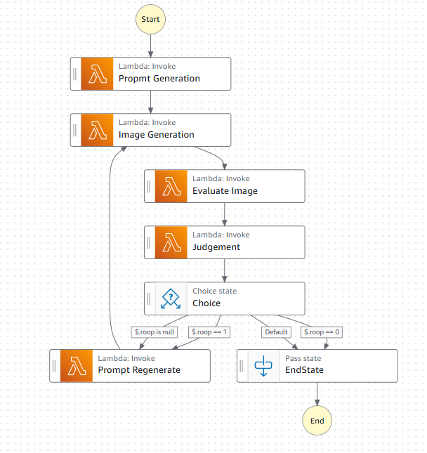

**シンプルなプロンプトからはじめて、思い通りの画像を生成しよう。**

[Progateハッカソン powered by AWS 2025.03](https://progate.connpass.com/event/342402/) 提出作品 【[発表資料(Topa'z)](https://topaz.dev/projects/b4eb8e8f682c0379df58)】

## プロダクト概要
AIエージェントを使った画像生成サービス。
従来の画像生成AIでは、複雑なプロンプトを使わなければ思った通りの画像を生成することができませんでした。  
また、マイナーなある特定の商品などの**固有名詞を含むプロンプトを入力しても、画像生成モデルが未学習で生成できない**といった問題がありました。

このサービスでは、**LLMがユーザが生成したい画像の内容を対話から汲み取り、画像生成モデルのプロンプトを試行錯誤しながらチューニング**することで、
画像生成モデルが未学習の概念を含む画像も出力できることを目指します。

「LLMは理解してくれてるけど、生成画像には全然反映されない！」というもどかしさをこのサービスが解決します。

## プロダクト詳細
ユーザが「さけるチーズを食べている10人の大学生男女」のようなプロンプトを入力すると、
まずLLMがそれをStable Diffusionに適したプロンプト（`a group of 10 young college students, males and females in their early 20s, eating string cheese and mozzarella cheese, ...`のような英単語区切り）に変換します。
次に、そのプロンプトをもとにStable Diffusionが画像を生成します。

生成された画像は再度LLMに入力され、その画像がユーザが入力したプロンプトにどれだけ沿っているかを5段階で評価します。
評価後、再生成の必要があると判断された場合にはStable Diffusionに入力するプロンプトの再生成が行われ、再度画像生成が始まります。

このループをLLMが再生成の必要がないと判断するまで行うことで、ユーザの意図通りの画像が最終的に出力されます。

## アーキテクチャ

**フロントエンド**: Flutter (Android, iOS, macOS, Web)  
**バックエンド**: AWS Lambda, AWS Step Functions  
**データベース**: Amazon Aurora RDS  
**生成AIモデル実行**: Amazon Bedrock

フロントエンドは GitHub Pages でホスティング、生成画像は Amazon S3 に保存しています。

フロントエンドからのログインや画像生成のリクエストは Amazon API Gateway を通して AWS Lambda に送信されます。  
画像生成処理については、ユーザのリクエスト毎に長時間のループ処理が行われるため、 AWS Lambda を組み合わせたフローを AWS Step Functions で構築し、そのステートマシンが実行しています。  
  
フロー中の各処理の結果は API Gateway を通してWebsocketによってフロントエンドに送信されるため、ユーザはリアルタイムにAIエージェントによる画像生成の試行錯誤の過程を見られるようになっています。

バックエンドの設計の詳細は[こちら](backend/README.md)をご覧ください。